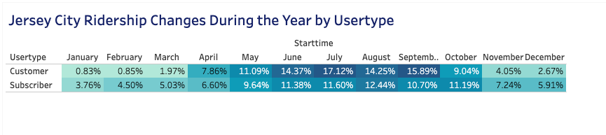
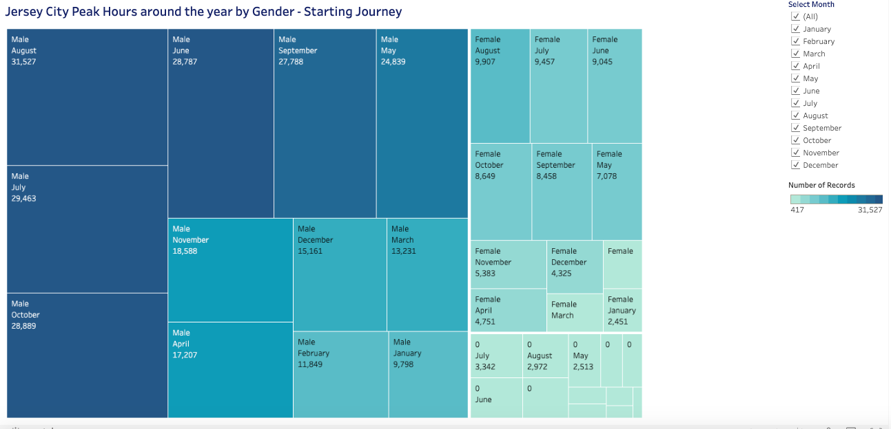
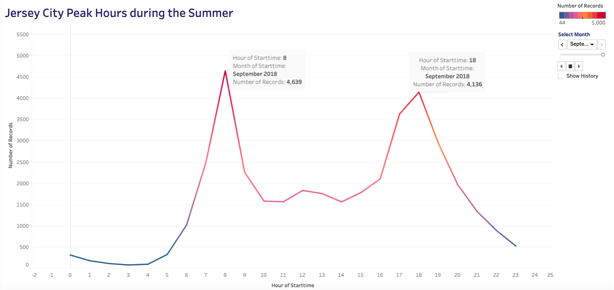
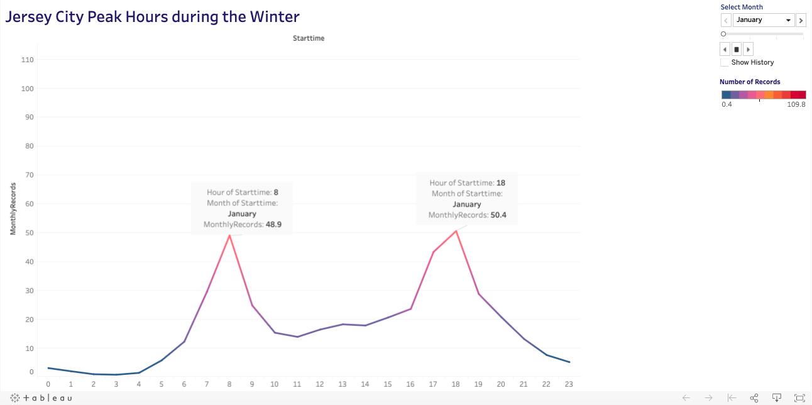
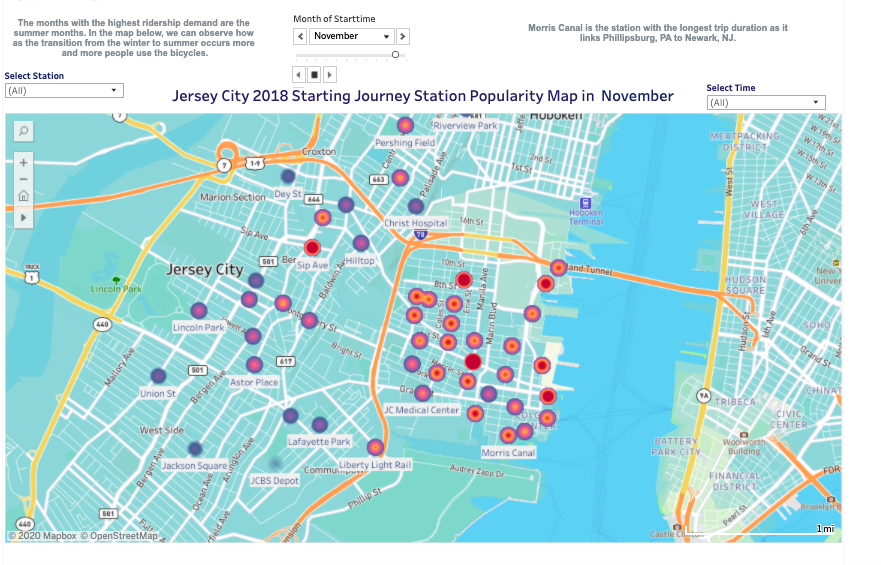
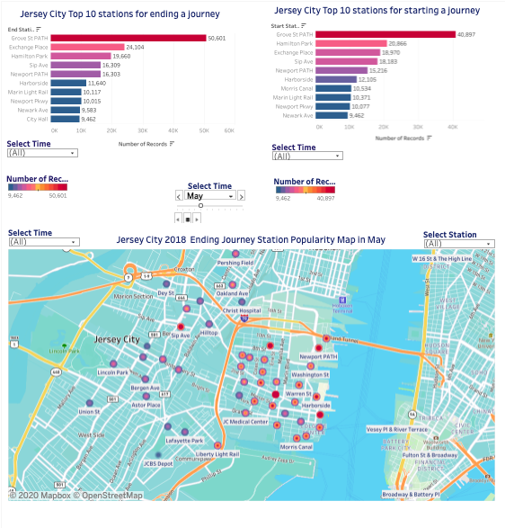
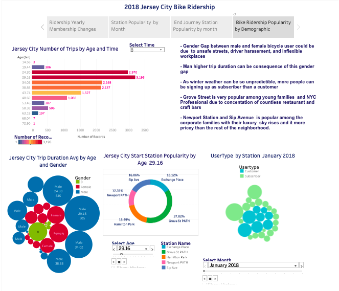

# Tableau---Citi-Bike-Analytics

#### Descriptiction
- Collected, organized, and cleaned data found in the Citi Bike Trip History Logs and found unexpected phenomena during 2018
- Linked to Tableau Public workbook

#### DataSet 

Citi Bike Data webpage
(https://www.citibikenyc.com/system-data)

#### Technology 
- Python 
- Pandas
- Tableau

#### Visualizations

#### 4 Visualizations reflecting unexpected phenomena

##### Jersey City Growth Percentage by User Type
https://public.tableau.com/profile/eliana.suarez#!/vizhome/BycecleRidershipChangesbyUsertupe/JerseyCityGrowthPercentagebyUserType?publish=yes

##### Jersey City Ridership by Gender
https://public.tableau.com/profile/eliana.suarez#!/vizhome/BicycleRidershipPeakHours/JerseyCityPeakHoursaroundtheyearbyGender-StartingJourney?publish=yes

##### Bicycle Ridership Summer Peak Hours
https://public.tableau.com/profile/eliana.suarez#!/vizhome/BicycleRidershipPeakHoursduringtheWinter/JerseyCityPeakHoursduringtheWinter

#####  Bicycle Ridership Winter Peak Hours 
https://public.tableau.com/trusted/Eor2ZElVSlqLHUt08WEbmQ==:w5e0FN2fek436SK3HqhMz2r7?:redirUrl=%2Fprofile%2Fapi%2Fpublish%2FBicycleRidershipPeakHoursduringtheWinter%2FJerseyCityPeakHoursduringtheWinter

    
##### 2 City Official Map and Dashboards

##### Starting Journey Comparison Map
https://public.tableau.com/profile/eliana.suarez#!/vizhome/JCMonthlyChangesinBikeRidership/StartingJourneyComparisonRidershipbyLocation?publish=yes

##### Ending Journey Comparison Map 
https://public.tableau.com/profile/eliana.suarez#!/vizhome/EndingJourneyComparisonMap/EndingJourneyComparisonRidershipbyLocation?publish=yes

##### 1 Story

##### Jersey City Bicycle Ridership 
https://public.tableau.com/profile/eliana.suarez#!/vizhome/JerseyCityBicycleRidershipChanges/JerseyCityBikeRidership?publish=yes

